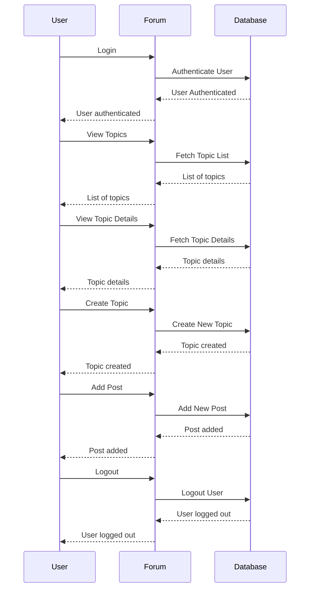
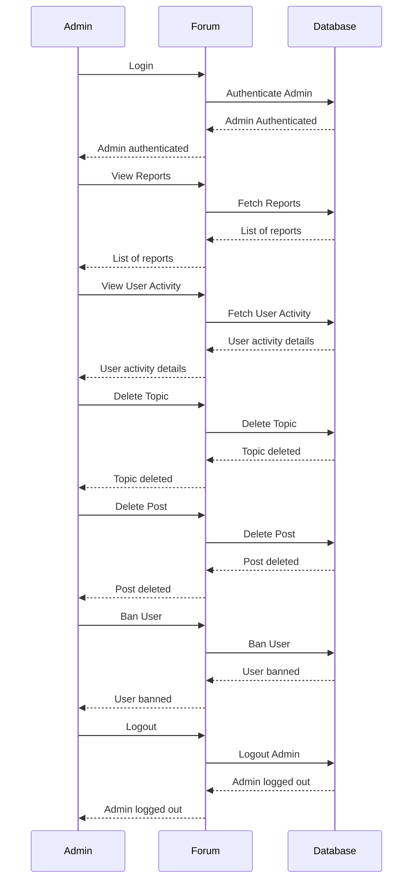
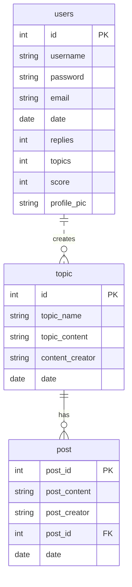

# PHP Forum App

Forum-App is a web application that enables users to participate in online discussions, create topics, and connect with other users in a forum-like environment.

## Main Objective/s 
The main objective of Forum-App is to provide a user-friendly platform for users to share ideas, exchange knowledge, and engage in meaningful conversations on various topics.

## Sequence Diagram

#### User Interaction

#### Admin's Interaction

## Entity Relationship Diagram

## Quick Installation
To quickly install and set up the Forum-App project, follow these steps:

  1. Clone the project repository: git clone <repository-url>
  2. Set up a web server (e.g., Apache) with PHP and MySQL support.
  3. Create a MySQL database and import the provided SQL file.
  4. Update the database connection details in the connect.php file.
  5. Configure the server to point to the project directory.
  6. Access the Forum-App in a web browser.

## Contributing
If you would like to contribute, please follow these guidelines:

  1. Fork the repository and create a new branch.
  2. Make your changes and ensure they are well-documented and tested.
  3. Submit a pull request explaining the changes you have made.

License
This project is licensed under the MIT License. See the LICENSE file for more details.
